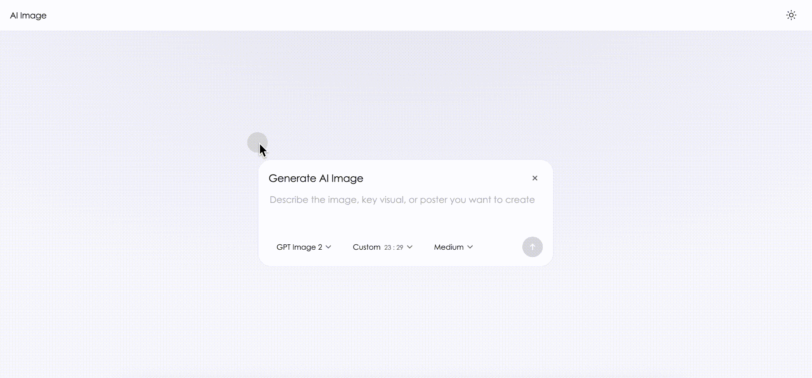

# UI-Lab

UI 组件实验仓库。

## Components

### Chat Input

AI 聊天输入框组件（含工具栏、状态控制等）。

- Source: [Components/Chat Input/chat-input.html](Components/Chat%20Input/chat-input.html)

### Aspect Ratio Picker

AI 图像生成对话框中的宽高比选择器（含模型选择、思考强度等设置项）。

- Source: [Components/Aspect Ratio Picker/aspect-ratio-picker.html](Components/Aspect%20Ratio%20Picker/aspect-ratio-picker.html)

